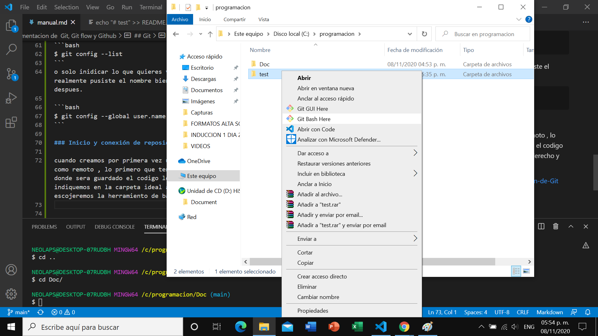
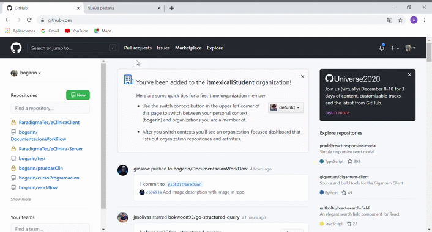

# Documentación de Git, Git Flow y GitHub

Es una guía rapida de todotipo de comandos a usar para el uso de git, git flow y git actions, tendremos enlaces de paginas principales donde enriquece la información de esta guía. 

  - [Git](#git)
    - [Configuración de Git](#configuración-de-git)
    - [Inicio y conexión de reposiotio locoal y remoto](#inicio-y-conexión-de-reposiotio-locoal-y-remoto)
    - [Creando Repositorio en GitHub](#creando-repositorio-en-github)
    - [Creando llaves y agregandola ah github](#creando-llaves-y-agregandola-ah-github)
    - [Conexion ha github por medio de https](#conexion-ha-github-por-medio-de-https)
    - [Listado Comandos Más usados de Git](#listado-comandos-más-usados-de-git)
      - [Iniciando repositorio](#iniciando-repositorio)
      - [GIT CLONE](#git-clone)
      - [GIT ADD](#git-add)
      - [GIT COMMIT](#git-commit)
      - [GIT PUSH](#git-push)
      - [GIT LOG](#git-log)
      - [GIT DIFF](#git-diff)
      - [GIT HEAD](#git-head)
      - [GIT REMOTE](#git-remote)
      - [GIT BRANCH](#git-branch)
      - [GIT TAG](#git-tag)
      - [GIT REBASE](#git-rebase)
      - [OTROS COMANDOS](#otros-comandos)
      - [Fork](#fork)
  - [enlaces](#enlaces)

## Git

miraremos de una forma rapida lo que son las configuraciones básicas, conexión por http o por ssh a tu repositorio remoto y algunos comandos más usados.

***

### Configuración de Git

Con estas operaciones, será fácil conseguir que Git trabaje exactamente como tú, tu empresa o tu grupo.

Podemos acceder a los ajustes de configuración de Git a través del comando git config. Una de las primeras acciones que has realizado con Git ha sido el configurar tu nombre y tu dirección de correo electrónico.

```bash
$ git config --global user.name "John Doe"
$ git config --global user.email johndoe@example.com
```

__core.editor__

Por defecto, Git utiliza cualquier editor que hayas configurado como editor de texto por defecto de tu sistema **( $VISUAL  o  $EDITOR)**. O, si no lo has configurado, utilizará vi como editor para crear y editar las etiquetas y mensajes de tus confirmaciones de cambio (commit). Para cambiar ese comportamiento, puedes utilizar el ajuste core.editor:

```bash
$ git config --global core.editor emacs
```

Para conocer lo que tienes guardado en el archivo de configuracion tan solo tienes que poner 

```bash
$ git config --list
```
o solo inidicar lo que quieres ver como por ejemplo si realmente pusiste el nombre bien o ver si quieres cambiarlo despues.

```bash 
$ git config --global user.name
```
***

### Inicio y conexión de reposiotio locoal y remoto

cuando creamos por primera vez un repositorio tanto local como remoto, lo primero que tendremos que hacer es uvicarnos donde sera guardado el codigo localmente cuando nos indiquemos en la carpeta ideal aremso click derecho y escojeremos la herramiento de base de git(esto es en Windows)




Después adentro del programa de comando por terminal (Git bash) pondremos git init dándole inicio al repositorio del proyecto 

```bash
$ git init
```
la hacer esto ya podremos ya sea trabajar o terminar la conexión a nuestro repositorio remoto.
>  _Pero antes tenemos que tener echo el repositorio remoto ([creaundo repositorio en github](#creando-repositorio-en-github))  y saber de cual forma conectarnos a nuestro repositorio ya sea por conexión por llaves ([reando llaves y agregandola ah github](#creando-llaves-y-agregandola-ah-github)) o por https([Conexion ha github por medio de https](#conexion-ha-github-por-medio-de-https))_

Después de hacer cambios al proyecto hay que subirlos en versión, Tu repositorio local está compuesto por tres "árboles" administrados por git. El primero es tu Directorio de trabajo que contiene los archivos, el segundo es el Index que actúa como una zona intermedia, y el último es el HEAD que apunta al último commit realizado, para eso usaremos el subcomando add el cual podemos indicar un solo documento o más nombrándolo o solamente indiciándolo con un punto.

  - un solo documento, carpeta etc. (modificación, creación o eliminación)
    ```bash
      $ git add README.md
    ```
  - todas las modificaciones creaciones y eliminaciones del proyecto
    ```bash
    $ git add .
    ``` 
al haber echo eso todo los cambios estarán en la rama index del proyecto
****

### Creando Repositorio en GitHub
 son simples pasos visuales el cual tamibne viene como hacerlo en tu computadora, aun asi se explica.


****
### Creando llaves y agregandola ah github


****
### Conexion ha github por medio de https


****
### Listado Comandos Usando Git Flow

### Inicialización

Para inicializar un nuevo repositorio con la estructura básica de la rama, use:
  ```bash
		git flow init [-d]
  ```
A continuación, esto le indicará de forma interactiva algunas preguntas sobre qué ramas le gustaría usar como ramas de desarrollo y producción, y cómo le gustaría que se nombraran sus prefijos. Simplemente puede presionar Retorno en cualquiera de esas preguntas para aceptar las (sensatas) sugerencias predeterminadas.

La ``-d`` bandera aceptará todos los valores predeterminados.


### Creación de ramas de funciones/versiones/revisiones/soporte

* Para listar/comenzar/terminar ramas de características, use:
  
  ```bash
  		$ git flow feature
  		$ git flow feature start <name> [<base>]
  		$ git flow feature finish <name>
  ```

Para las ramas de características, el `<base>` argumento debe ser una confirmación `develop`.
  
* Para enviar/extraer una rama de funciones al repositorio remoto, use:
```bash
  		$ git flow feature publish <name>
		  $ git flow feature pull <remote> <name>
```
* Para listar/comenzar/finalizar las ramas de lanzamiento, use:
    ```bash
  		$ git flow release
  		$ git flow release start <release> [<base>]
  		$ git flow release finish <release>
  ```

  Para las ramas de lanzamiento, el `<base>` argumento debe ser una confirmación `develop`.

  
* Para enumerar/iniciar/finalizar las ramas de revisión, use:
    ```bash
  		$ git flow hotfix
  		$ git flow hotfix start <release> [<base>]
  		$ git flow hotfix finish <release>
  ```
  Para las ramas de revisión, el  `<base>`argumento debe ser una confirmación `master`.

* Para listar/iniciar ramas de soporte, use:
    ```bash
    $ git flow support
    $ git flow support start <release> <base>
  ```

  Para las ramas de soporte, el `<base>` argumento debe ser una confirmación `master`.
****
### Listado Comandos Más usados de Git

Configurar Nombre que salen en los commits
```bash
	$ git config --global user.name "dasdo"
```
Configurar Email
```bash	
	$ git config --global user.email dasdo1@gmail.com
```
Marco de colores para los comando
```bash
	$ git config --global color.ui true
```

### Iniciando repositorio

Iniciamos GIT en la carpeta donde esta el proyecto
```bash
	$ git init
```
Clonamos el repositorio de github o bitbucket
```bash
	$ git clone <url>
```
Añadimos todos los archivos para el commit
```bash
	$ git add .
```
Hacemos el primer commit
```bash
	$ git commit -m "Texto que identifique por que se hizo el commit"
```
subimos al repositorio
```bash
	$ git push origin master
```

### GIT CLONE


Clonamos el repositorio de github o bitbucket
```bash
	$ git clone <url>
```
Clonamos el repositorio de github o bitbucket ?????
```bash
	$ git clone <url> git-demo
```

### GIT ADD


Añadimos todos los archivos para el commit
```bash
	$ git add .
```
Añadimos el archivo para el commit
```bash
	git add <archivo>
```
Añadimos todos los archivos para el commit omitiendo los nuevos
```bash
	$ git add --all 
```
Añadimos todos los archivos con la extensión especificada
```bash
	$ git add *.txt
```
Añadimos todos los archivos dentro de un directorio y de una extensión especifica
```bash
	$ git add docs/*.txt
```
Añadimos todos los archivos dentro de un directorios
```bash
	$ git add docs/
```
### GIT COMMIT

Cargar en el HEAD los cambios realizados
```bash
	$ git commit -m "Texto que identifique por que se hizo el commit"
```
Agregar y Cargar en el HEAD los cambios realizados
```bash
	$ git commit -a -m "Texto que identifique por que se hizo el commit"
```
De haber conflictos los muestra
```bash
	$ git commit -a 
```
Agregar al ultimo commit, este no se muestra como un nuevo commit en los logs. Se puede especificar un nuevo mensaje
```bash
	$ git commit --amend -m "Texto que identifique por que se hizo el commit"
```
### GIT PUSH

Subimos al repositorio
```bash
	$ git push <origien> <branch>
```
Subimos un tag
```bash
	$ git push --tags
```
### GIT LOG

Muestra los logs de los commits
```bash
	$ git log
```
Muestras los cambios en los commits
```bash
	$ git log --oneline --stat
```
Muestra graficos de los commits
```bash
	$ git log --oneline --graph
```
### GIT DIFF

Muestra los cambios realizados a un archivo
```bash
	$ git diff
	$ git diff --staged
```
### GIT HEAD

Saca un archivo del commit
```bash
	$ git reset HEAD <archivo>
```
Devuelve el ultimo commit que se hizo y pone los cambios en staging
```bash
	$ git reset --soft HEAD^
```
Devuelve el ultimo commit y todos los cambios
```bash
	$ git reset --hard HEAD^
```
Devuelve los 2 ultimo commit y todos los cambios
```bash
	$ git reset --hard HEAD^^
```
Rollback merge/commit
```bash
	$ $ git log
	$ git reset --hard <commit_sha>
```
### GIT REMOTE

Agregar repositorio remoto
```bash
	$ git remote add origin <url>
```
Cambiar de remote
```bash
	$ git remote set-url origin <url>
```
Remover repositorio
```bash
	$ git remote rm <name/origin>
```
Muestra lista repositorios
```bash
	$ git remote -v
```
Muestra los branches remotos
```bash	
	$ git remote show origin
```
Limpiar todos los branches eliminados
```bash
	$ git remote prune origin 
```
### GIT BRANCH

Crea un branch
```bash
	$ git branch <nameBranch>
```
Lista los branches
```bash
	$ git branch
```
Comando -d elimina el branch y lo une al master
```bash
	$ git branch -d <nameBranch>
```
Elimina sin preguntar
```bash
	$ git branch -D <nameBranch>
```
### GIT TAG

Muestra una lista de todos los tags
```bash
	$ git tag
```
Crea un nuevo tags
```bash
	$ git tag -a <verison> - m "esta es la versión x"
```
### GIT REBASE

Los rebase se usan cuando trabajamos con branches esto hace que los branches se pongan al día con el master sin afectar al mismo

Une el branch actual con el mastar, esto no se puede ver como un merge
```bash
	git rebase
```
Cuando se produce un conflicto no das las siguientes opciones:

cuando resolvemos los conflictos --continue continua la secuencia del rebase donde se pauso
```bash	
	$ git rebase --continue 
```
Omite el conflicto y sigue su camino
```bash
	git rebase --skip
```
Devuelve todo al principio del rebase
```bash
	$ git reabse --abort
```
Para hacer un rebase a un branch en especifico
```bash	
	$ git rebase <nameBranch>
```
### OTROS COMANDOS

Lista un estado actual del repositorio con lista de archivos modificados o agregados
```bash
	$ git status
```
Quita del HEAD un archivo y le pone el estado de no trabajado
```bash
	$ git checkout -- <file>
```
Crea un branch en base a uno online
```bash
	$ git checkout -b newlocalbranchname origin/branch-name
```
Busca los cambios nuevos y actualiza el repositorio
```bash
	$ git pull origin <nameBranch>
```
Cambiar de branch
```bash
	$ git checkout <nameBranch/tagname>
```
Une el branch actual con el especificado
```bash
	$ git merge <nameBranch>
```
Verifica cambios en el repositorio online con el local
```bash
	$ git fetch
```
Borrar un archivo del repositorio
```bash
	$ git rm <archivo> 
```

### Fork

Descargar remote de un fork
```
	$ git remote add upstream <url>
```

Merge con master de un fork
```
	$ git fetch upstream
	$ git merge upstream/master
```
****

### Enlaces
[configuracion git](https://git-scm.com/book/es/v2/Personalizaci%C3%B3n-de-Git-Configuraci%C3%B3n-de-Git)

